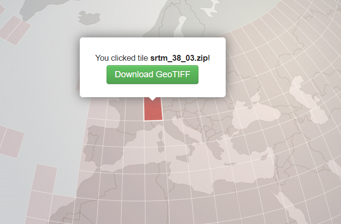

# Countour Lines and Hillshade files for Europe

A docker image to create vector tiles for contour lines and hillshade (relief) raster tiles of europe (mbtiles files).

The relief and is based on data from [SRTM 90m DEM Digital Elevation Database](http://srtm.csi.cgiar.org) and
[OpenSlopeMap](https://www.openslopemap.org/).

## Getting it

```bash
git clone https://github.com/joe-akeem/contour-tiles.git
```

## Building the mbtiles files

```bash
cd contour-tiles
docker-compose -f docker-compose-compute.yml build contour-tiles && docker-compose -f docker-compose-compute.yml up
```

This will build the mbtiles files in the folder `./osm/mbtiles`

## Area

By default, the Europe area will be covered (defined in `.env`). The configuration for other areas has been prepared in
the `.env-*` files. For example, to build the contour tiles for South America, pass the corresponding environment file to
`docker-compose` as follows:

```bash
docker-compose --env-file .env-south-america -f docker-compose-compute.yml up
```

To completely customize the area, please use this tool [SRTM Tile Grabber](https://dwtkns.com/srtm/). You'll be able to
identify the tiles that will be needed to build your data:



On this image, the name of the tile is `srtm_38_03.zip`. X is 38, Y is 03. For example, to compute
Hawaii only, you can export the custom area as environment variables before running `docker-compose`:

```bash
export MIN_X=05 MAX_X=06 MIN_Y=08 MAX_Y=09
```

Please note that `MIN_Z` and `MAX_Z` are the limit in terms of altitude.

For a dry run to verify the configuration before launching the whole process run:

```bash
docker-compose -f docker-compose-compute.yml config
```

Then start the building of the tiles as before:

```bash
docker-compose -f docker-compose-compute.yml up
```

## Computing large areas

With the view to be able to compute areas, many improvements have been done. First of all, the main bottleneck was the use of `gdal_contour`. It's a single core process...

To be able to overcome this problem, this script can now compute contour using parallelized job. You'll be able to define the number of parallel jobs using
the `CONTOUR_JOBS` variables, in the `docker-compose-compute.yml` file. Beware of the fact that you should limit the number of jobs to the number of core
that your host has. Moreover, each job will consume a lot of RAM, essentially dependent upon the size of the area. For the default area, i use 8 jobs with 16
GB free RAM.

Last problem, the long time taken by `gdal_translate`... Adding cache can speed up the process, but don't expect a huge difference. The variable is
`GDAL_CACHEMAX`, in MB.

## Inspecting the tiles

To inspect the mbtiles files a local tileserver can be started as follows:

```bash
docker-compose up
```
The web interface of the tile server is made available at [localhost:8080](http://localhost:8080).
A basic style is also available and can be used to view the generated data e.g. as [Vector Tiles](http://localhost:8080/styles/basic/?vector#13.57/46.49646/8.61135).

You will notice that there are contour lines for 100 meter and for 20 meter equidistance. The 100 meter equidistance lines
will start showing from zoom level 10 while the 20 meter equidistance lines are showing from zoom level 13 upwards.
 
The contour lines are tagged with three fields:
* `elev`: the elevation of the contour line in meters above sea level
* `distance: the equidistance of the contour line (20m or 100m) which helps styling them differently. E.g. you might want
  to show the 100 meter lines more prominent.
* `type`: this is currently `normal` for all contour lines. There are plans to encode the terrain in this field
  (e.g. `normal`, `rock`, `glacier`) so you can style the lines differently depending on the terrain (e.g. blue for glaciers).


## Performances

The container has been tried with success on an Azure VM, Standard_D8ds_v5 with
a P30 SSD (1To, 5kIOPS). The whole process for Europa took about 30 minutes.

The container has been used with success on an Azure VM, Standard_HB60-45rs with
a P30 SSD (1To, 5kIOPS). The whole process for *Planet* took about 3 days. Even if
this machine had a lot of cores, the RAM was the limiting factor. I had to use
these parameters in the compose file :

```
MIN_X: 01 
MAX_X: 72
MIN_Y: 01
MAX_Y: 24
MIN_Z: 0
MAX_Z: 9000
CONTOUR_JOBS: 8
GDAL_CACHEMAX: 160000
```